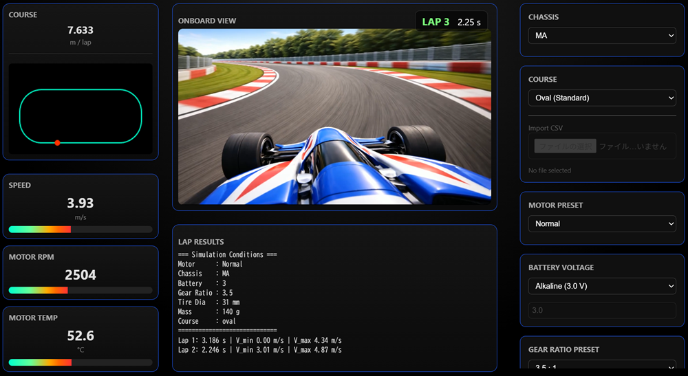

## MiniRacerSim

MiniRacerSim is a lightweight Mini Racer (1:32 scale racer) simulation tool that allows you to visualize and analyze vehicle behavior on custom tracks.

---

## 🚀 Features

* Real-time simulation of Mini Racer behavior
* Track-based physics simulation
* Simple UI running in your browser
* No installation required (standalone EXE)

---

## 🖥️ Requirements

* Windows 10 / 11 (64-bit)
* No Python installation required

---

## 📦 Download & Run

1. Download the latest release ZIP
2. **Extract the ZIP file**
3. Run: MiniRacerSim.exe
4. Your browser will open automatically
   If not, open: http://127.0.0.1:8000

---

## ⚠️ Important Notes

* Do NOT run the EXE inside the ZIP file
* Windows may show a security warning:
  * Click **"More info" → "Run anyway"**
* First launch may take a few seconds

---

## 🛑 How to Exit

* Close the browser window
* The application will shut down automatically

---

## 🧪 Current Status

This is a **Beta version**.

* Features may change
* Bugs may exist
* Feedback is welcome!

---

## 🧩 Included Components

* Simulation engine (Python + FastAPI)
* Web UI (HTML/JS)
* Sample track data (CSV)
* Onboard video

---

## 📷 Demo

(Add GIF or demo video here later)

---

## 📌 Roadmap

* [ ] Performance improvements
* [ ] More track variations
* [ ] Parameter tuning UI
* [ ] Multi-car simulation (race mode)
* [ ] Export / analysis tools

---

## 🤝 Contributing

Contributions, ideas, and feedback are welcome!

---

## 📄 License

(To be decided — MIT recommended)

---

## 🇯🇵 Japanese Documentation

日本語版はこちら： README_ja.md

---

## 👤 Author

Created by Masaaki Furukawa

---

## ⭐ If you like this project

Give it a star on GitHub!

