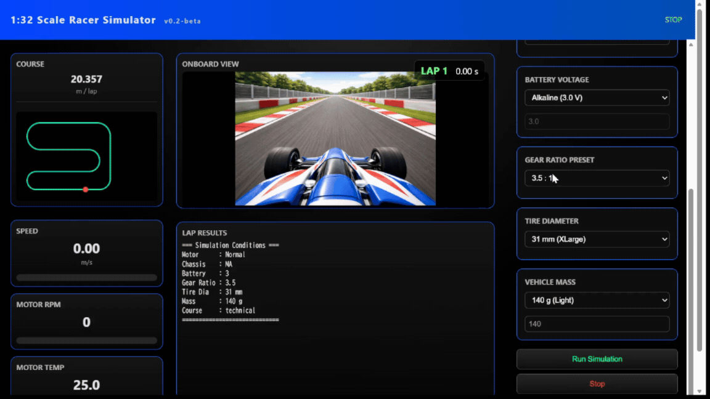

# MiniRacerSim

v0.2-beta を公開しました！

ダウンロードはこちら：
https://github.com/aotechlab/MiniRacerSim/releases

MiniRacerSim は、カスタムトラック上での車両挙動を可視化・解析できる、軽量なミニレーサー（1:32スケール）シミュレーションツールです。

---

## 🚀 主な機能

* ミニレーサーのリアルタイムシミュレーション
* トラック形状に基づいた物理シミュレーション
* ブラウザで動作するシンプルなUI
* インストール不要（単体EXEで実行可能）

---

## 🖥️ 動作環境

* Windows 10 / 11（64bit）
* Pythonのインストール不要

---

## 📦 ダウンロードと起動方法

1. 最新のZIPファイルをダウンロード
2. **ZIPファイルを解凍**
3. 以下を実行：

MiniRacerSim.exe

4. ブラウザが自動で起動します
   起動しない場合は以下を開いてください：

http://127.0.0.1:8000

---

## ⚠️ 注意事項

* ZIPファイル内のままEXEを実行しないでください
* Windowsのセキュリティ警告が表示される場合があります

  * 「詳細情報」→「実行」を選択してください
* 初回起動には数秒かかる場合があります

---

## 🛑 終了方法

* ブラウザを閉じると自動的にアプリが終了します

---

## 🧪 現在の状態

本ソフトは **ベータ版** です。

* 機能は今後変更される可能性があります
* 不具合が含まれている可能性があります
* フィードバック歓迎です

---

## 🧩 含まれる構成

* シミュレーションエンジン（Python + FastAPI）
* Web UI（HTML / JavaScript）
* サンプルトラックデータ（CSV）
* オンボード動画

---

## 📷 デモ

（今後GIFや動画を追加予定）

---

## 📌 今後の予定

* [ ] パフォーマンス改善
* [ ] トラックバリエーション追加
* [ ] パラメータ調整UI
* [ ] 複数台同時走行（レースモード）
* [ ] データ出力 / 解析機能

---

## 🤝 コントリビューション

アイデア・改善提案・フィードバック歓迎です！

---

## 📄 ライセンス

（未定 — MITライセンス推奨）

---

## 👤 作者

Masaaki Furukawa

---

## ⭐ 気に入ったら

GitHubでスターをお願いします！
